# MediaPipe sur Touchdesigner

*[english version](https://github.com/LucieMrc/MediaPipe_TD_EN)*

*Ou comment utiliser MediaPipe dans TouchDesigner, récupérer les données et les utiliser pour interagir avec du visuel.*

- Le tuto [introduction à Touchdesigner](https://github.com/LucieMrc/IntroTD_FR)

## MediaPipe ???

[MediaPipe](https://developers.google.com/mediapipe) est un framework de machine-learning centré sur la computer vision.
Dans Touchdesigner, on peut l'utiliser notamment pour récuperer la position du squelette d'une personne devant une webcam, et créer des interactions avec.

La [documentation de MediaPipe pour TD](https://github.com/torinmb/mediapipe-touchdesigner?tab=readme-ov-file) sur github, avec la [vidéo de présentation](https://www.youtube.com/watch?v=Cx4Ellaj6kk&ab_channel=TorinBlankensmith).

Le [lien de téléchargement](https://github.com/torinmb/mediapipe-touchdesigner/releases) de la dernière version.

*Le fichier d'exemple MediaPipeTouchdesigner.toe.*

MediaPipe permet de tracker notamment les mains, le visage, les parties du corps.

Les usages :

Exemple de post instagram de @pepepepebrick

Exemple de post instagram de @poetengineer

## Le fichier MediaPipeTouchdesigner.toe

### A. le node MediaPipe

Le node MediaPipe contient pleins de choses qui le font marcher, dans lesquels on ne rentrera pas en détails.

### B. les infos sur le temps réel

La première sortie du node MediaPipe est un CHOP qui permet de vérifier si on récupère bien les données en temps réel.

### C. le tracking du visage, des mains et du squelette

Le tracking du visage avec le node face_tracking permet de récupérer notamment la position du visage et de chacun de ses points, ainsi qu'un masque 3D du visage. On peut tracker jusqu'à 5 visages.

Le tracking des mains avec le node hand_tracking permet de récupérer la position des mains et de leurs points, ainsi qu'un rendu 3D.

*Les points de la main gauche et des doigts*

On récupère également la vélocité des mains, la distance entre les mains, et les données du geste de "pincer" dans le CHOP `helpers`, et 8 gestes pour chaque main dans le CHOP `gestures`.

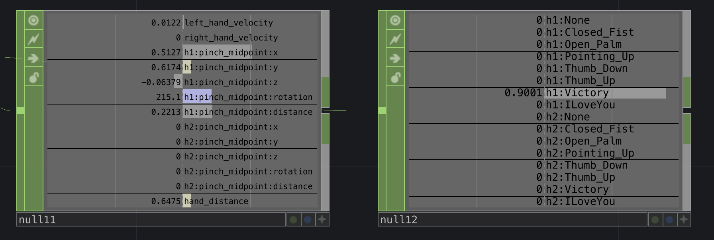

Le tracking du squelette avec le node pose_tracking permet de récupérer les positions des différentes parties du corps, ainsi que la vélocité des poignets et la distance des mains. On peut tracker jusqu'à 5 personnes.

### D. la détection des objets et du visage

La détection et la classification des objets avec le node object_tracking1 sert à reconnaître les objets sur la vidéo avec plus ou moins de certitude. Ça ne marche pas hyper bien.

*Ici la détection de mon téléphone avec seulement 55% de certitude*

Le node face_detector1 sert à détecter des visages et sortir la positions de leurs points.

Le node image_classification essaie de reconnaître des objets sur l'image. Ça ne marche pas hyper bien.

### E. la Virtual Webcam Chain

Faire du post process extérieur à touch (obs) pour le réintégrer à Touch

### F. le node image_segmentation

En cochant le paramètre `Image Segmentation` dans le node MediaPipe, le visuel de la webcam dans le node MediaPipe devient segmenté par couleur en fonction de la partie du corps (main, visage, cheveux) et du fond.

En sortie du node image_segmentation, on a alors une sortie par couleur qui nous donne la forme en blanc sur fond transparent, et la silhouette en couleur sur fond transparent si la Virtual Webcam Chain est activée.

Le mieux est de décocher `Show overlays` pour enlever toutes les détections sur l'image de la webcam et ne pas les avoir sur les images segmentées.

## Récupérer les données

On peut récupérer les coordonnées des points detectés par MediaPipe (position du visage, des mains, du corps, ainsi de suite) pour venir faire apparaître et déplacer des élements par dessus le retour webcam.
Pour cela, on peut le faire en 2D avec des TOP ou en 3D avec des SOP.

## En 2D avec des TOPs

Pour n'activer que le hand tracking vu qu'on n'utilise que les points de la main, on décoche tout sauf "Detect Hands" dans les paramètres de `MediaPipe`. On n'oublie pas de décocher également "Show overlays" pour que les points detectés ne s'affichent pas par dessus l'image de la webcam.

 
On peut par exemple récupérer la position du "pinch" (le pincée entre le pouce et l'index), et l'écart mesuré. On crée un `Select` TOP sur la sortie "helpers" (la 4ème), et on sélectionne "h1:pinch_midpoint:distance" (l'écart entre les doigts), "h1:pinch_midpoint:x" et "h1:pinch_midpoint:y" (la position x et y du milieu de l'écart entre les doigts).

On crée ensuite un `Circle` TOP, et on change le paramètre "radius" de 1 à 0.1. Finalement, on change la résolution afin qu'elle soit la même que la webcam (ici, 1280*720).

Pour que le cercle se déplace, on assigne la variable "h1:pinch_midpoint:x" à "center x", et "h1:pinch_midpoint:y" à "center y".

On voit néanmoins que le cercle reste dans le coin en haut à droite de l'image au lieu de se déplacer dans toute l'image.

En effet, les positions x et y du midpoint sont normalisées entre 0 et 1 où 0,0 est en bas à gauche de l'image, tandis que sur les textures dans TouchDesigner, le 0,0 est au milieu de l'image et les positions x et y sont entre -0.5 et 0.5 .

Il faut donc décaler cette plage de valeur, et pour cela on crée un `Select` CHOP pour choisir uniquement "h1:pinch_midpoint:x", puis on crée un `Math` CHOP.

Dans l'onglet "Range" du `Math` CHOP, on garde de 0 à 1 pour "From Range" et on met de -0.5 à 0.5 pour la "To Range".

En assignant la variable "h1:pinch_midpoint:x" du `Math` CHOP à "center x" du `Circle` TOP, notre cercle se déplace maintenant bien dans toute l'image sur x.

Pour faire la même chose pour y, on recrée un `Select` CHOP en sortie du `Select` précedent, pour choisir "h1:pinch_midpoint:y", puis on crée un `Math` CHOP.

Dans l'onglet "Range" du `Math` CHOP, on doit mettre de 0.2 à 0.8 pour "From Range", car c'est les minimum et maximum que l'on observe en déplaçant la main de bas en haut de l'écran, et on met de -0.5 à 0.5 pour la "To Range".

En assignant la variable "h1:pinch_midpoint:y" du `Math` CHOP à "center y" du `Circle` TOP, notre cercle se déplace maintenant bien dans toute l'image sur x et sur y.

On peut alors créer un `Composite` TOP et y entrer le `Circle` TOP ainsi que l'image de la webcam en sortie du node MediaPipe, et utiliser l'opération "Over" dans les paramètres du `Composite`. On voit donc le cercle bouger en suivant le milieu entre le pouce et l'index.

Pour que la taille du cercle dépende de l'écart entre les doigts, on assigne la variable "h1:pinch_midpoint:distance" au paramètre "Radius" du `Circle` TOP. Ici, je divise par deux la variable afin que cercle soit plus petit.

## En 3D avec des SOPs

Il y a plusieurs manières permettant de déplacer des élements en 3D grâce aux données de MediaPipe. On choisit la manière la plus adaptée en fonction du nombre d'élements, des interactions entre les différents élements et en fonction des paramètres spécifiques à ces élements.

Elles sont ici de la plus facile à la plus compliquée : data links, instanciation, Replicator.

Il y a deux étapes communes aux trois méthodes : 
- Modifier les paramètres du `Camera` COMP afin que les points puissent se superposer au rendu de la webcam.
- Créer un `Composite` TOP dans lequel on met le `Render` TOP et la dernière sortie du node `MediaPipe` pour superposer le rendu de la webcam et les élements que l'on fait apparaître.

### Data links

On utilise les data links, la manière dont on a fait apparaître un point rouge 2D ci-dessus, lorsque qu'on veux faire apparaître peu d'élements, et/ou que l'on veux pouvoir jouer avec les paramètres propres de chaque élement. C'est néanmoins la méthode la plus longue.

C'est la méthode utilisée dans le projet "handTrackingExemple.toe".

Il faut d'abord sélectionner les coordonnées des points qui nous intéressent. Ici, on va venir placer une sphère sur la pointe de chaque doigt (= fingertip).

On crée donc un `Select` CHOP à la deuxième sortie du node `MediaPipe`, et on sélectionne dans "Channel Names" les valeurs x, y et z de chaque bout de doigt pour h1.

Donc pour le pouce : h1:thumb_tip:x h1:thumb_tip:y h1:thumb_tip:z

Pour l'index : h1:index_finger_tip:x etc

Puis pareil pour h1:middle_finger_tip, h1:ring_finger_tip, h1:pinky_tip en x y et z pour chaque.

À la place de lister chaque nom de coordonnées, on peut aussi écrire `h1:*_tip:*`, où "*" signifie "tout".

Donc `h1:*_tip:*` = h1:[tout]_tip:[tout].

Si on veux avoir les deux mains, on peut faire pareil pour h2 (et écrire `*_tip:*` pour avoir [tout]_tip:[tout] ).

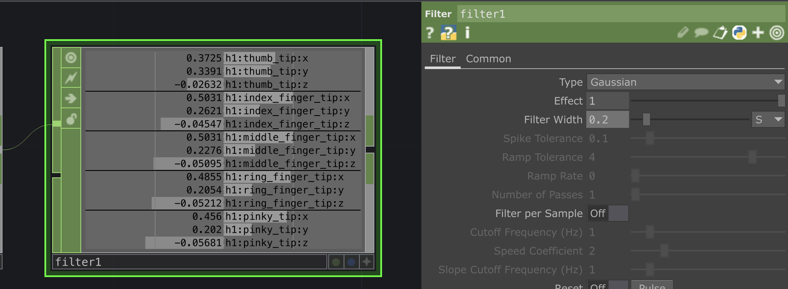

Après le `Select`, on crée un `Filter` CHOP afin de lisser légèrement les données et éviter les mouvements saccadés. On met 0.2 dans le paramètre "Filter Width" ce qui veux dire que les valeurs sont lissées sur 0.2 secondes.

Plus la valeur (en seconde) est élevée, plus il y aura un effet de "lag" sur le déplacement, ne pas hésitez à revenir modifier la valeur du `Filter` plus tard pour choisir la valeur idéale.

On ajoute un `Null` CHOP après le `Filter`.

Ensuite, on crée 5 `Sphere` SOP, qui se placeront au bout des 5 doigts. Dans les paramètres de chaque SOP, on met 0.05 comme Radius x, y et z.

Dans les paramètres du premier `Sphere` SOP, on met les coordonnées x, y et z du pouce en sortie du `Null` CHOP dans le paramètre Center x, y et z.

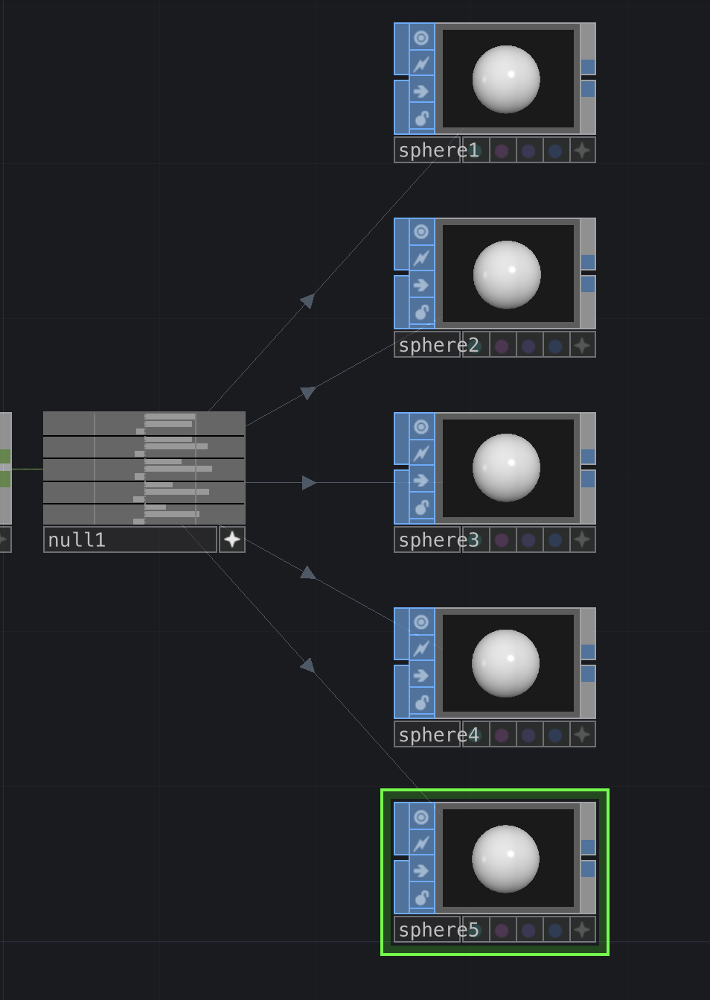

On fait pareil pour les coordonnées de chaque doigt sur chaque sphère.

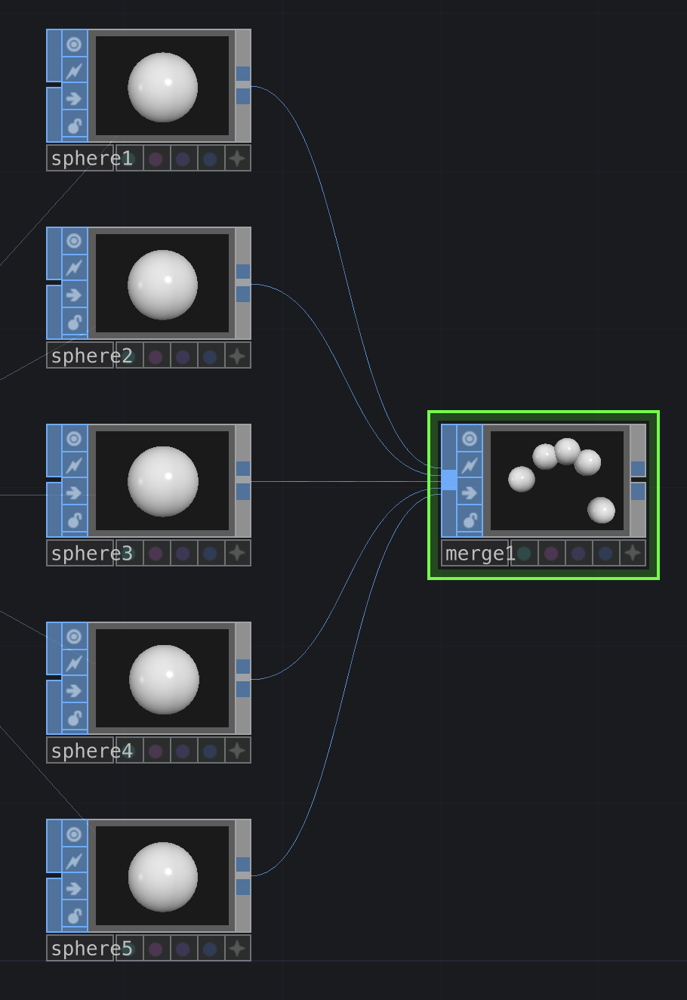

On crée ensuite un `Merge` SOP pour réunir les 5 sphères.

On crée finalement un `Geo` COMP, puis un `Render` TOP pour obtenir un rendu de nos sphères.

Pour la camera, on crée un `Camera` COMP mais dans les paramètres on met 0.5 en Translate x et y, et 1 en Translate z dans le premier onglet.

Dans l'onglet "View" des paramètres de la `Camera`, on met "Orthographic" dans le paramètre "Projection" et "1" pour "Ortho Width".

On met également "0.9" en "Near" et "10" en "Far".

Sans ces modifications, on ne pourra placer le rendu par dessus l'image de la webcam.

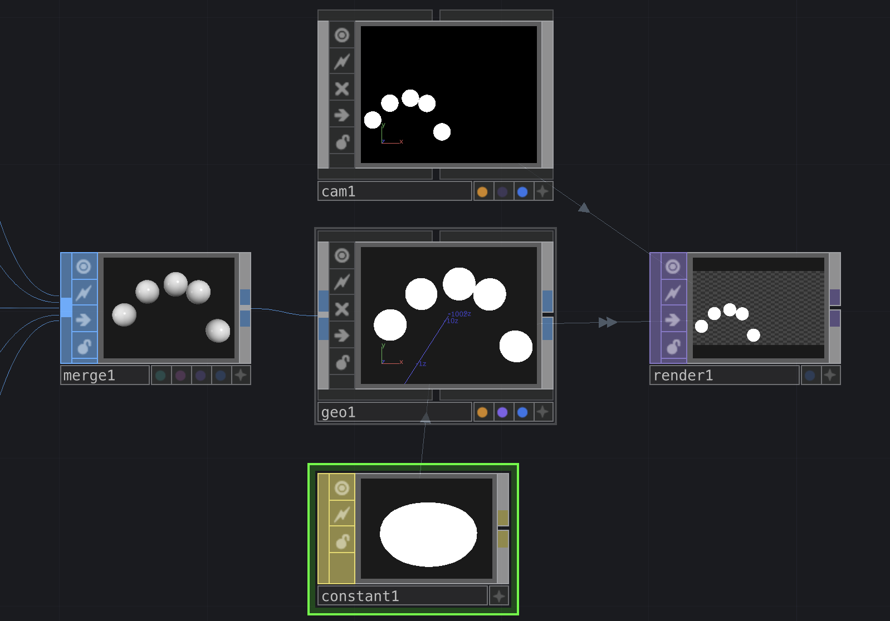

On crée un `Constant` MAT pour appliquer une couleur sur le `Geo`.

Après le `Render` TOP, on crée un `Composite` TOP dans lequel on met également la dernière sortie du node `MediaPipe` afin de mettre les sphères par dessus la webcam. On met "Atop" comme "Operation" dans les paramètres du `Composite`.

Notes: 
- On pourrait comparer la position des sphères les unes entre les autres pour créer des évenements collisions.
- On pourrait adapter la taille des sphères en fonction de la distance sur z du doigt à la caméra, en créant une formule avec la coordonnée z dans le Radius de chaque `Sphere`.
- Au lieu d'utiliser un `Merge` SOP, on pourrait créer un `Geo` pour chaque sphère et les combiner tous dans le `Render` TOP. Ça permettrait que chaque sphère ait un material différent/une couleur différente.

### Instaciation

On utilise l'instanciation lorsque l'on veux créer rapidement beaucoup d'élements, sur lesquels on ne pourra pas agir individuellement.

On commence par créer 5 `Select` CHOP. On va vouloir récupérer les positions x, y et z de chaque pointe de doigts dans chaque `Select`. 

Dans le paramètre "Channel Names", on écrit donc pour le premier "h1:thumb_tip:*" pour avoir tous les channels dont le nom commence par "h1:thumb_tip:".

On fait pareil dans le second `Select` avec "h1:index_finger_tip:*" et ainsi de suite pour les 5.

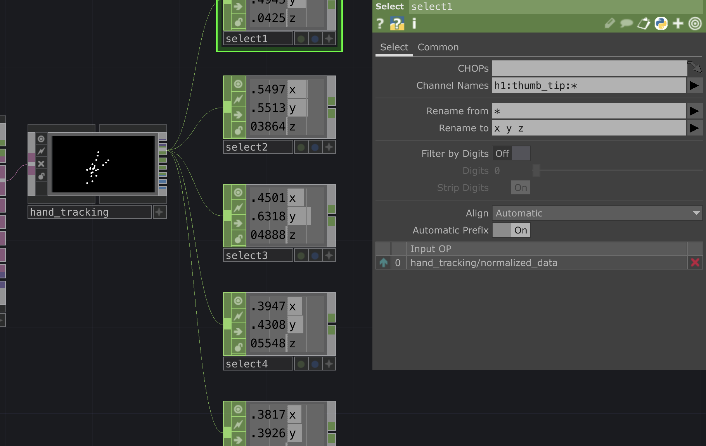

Ensuite, dans le paramètre "Rename to" des 5 `Select` CHOP, on écrit "x y z" pour que tous les channels s'appellent "x", "y" et "z" dans chaque `Select`.

Cela va nous permettre de créer 3 channels x, y et z avec 5 samples qui seront chaque doigt.

On crée donc un `Join` CHOP dans lequel on entre les 5 `Select` et on peut directement voir les 3 courbes x, y et z.

Comme dans la méthode des data links, on peut ajouter un `Filter` CHOP entre chaque `Select` et le `Join` pour lisser les channels et éviter les mouvements saccadés. On peut mettre 0.2 comme "Filter Size" dans les paramètres.

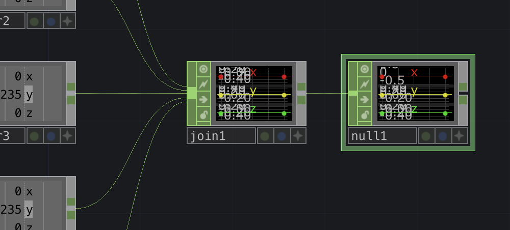

Après le `Join` CHOP, on crée un `Null` CHOP.

On crée ensuite un `Sphere` SOP, qui sera la forme 3D que l'on va instacier. On réduit sa taille en mettant "0.05" comme paramètre pour "Radius" x, y et z.

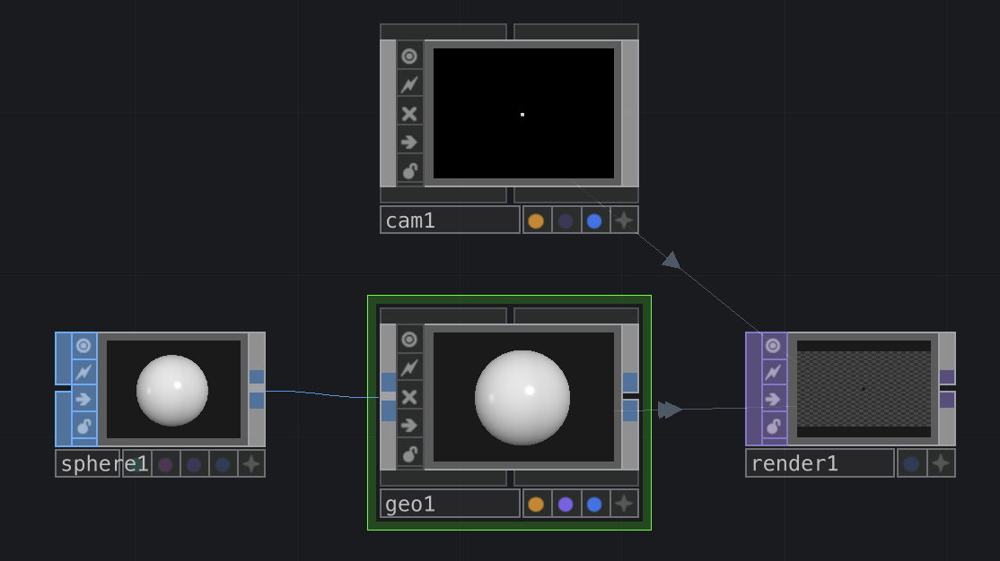

On crée ensuite un `Geo` COMP, un `Camera` COMP et un `Render` TOP.

Comme dans la méthode des data links, on met 0.5 en Translate x et y, et 1 en Translate z dans le premier onglet des paramètres du `Camera` COMP.

Dans l'onglet "View" des paramètres de la `Camera`, on met "Orthographic" dans le paramètre "Projection" et "1" pour "Ortho Width".

On met également "0.9" en "Near" et "10" en "Far".

Pour créer l'instanciation, on va dans l'onglet "Instance" des paramètres du `Geo`, et on active le paramètre "Instancing".

Pour que 5 sphères soient créées aux positions x, y et z de chaque sample du `Null` CHOP, on fait glisser (ou on écrit le nom du node) le `Null` CHOP dans le paramètre "Translate OP", et on écrit x, y et z respectivement dans les paramètres "Translate X", "Y" et "Z".

On crée un Material de notre choix pour appliquer au `Geo`, ici j'ai crée un `Constant` MAT.

Pour pouvoir modifier la taille de chaque sphère en fonction de la distance à la caméra (et donc la taille du doigt à l'écran), on crée un `Select` CHOP en sortie du `Join` et on ne sélectionne que le channel z.

On crée ensuite un `Math` CHOP, et on va dans l'onglet "Range" des paramètres.

En approchant et reculant ma main de la webcam, je vois que z est entre 0 (quand ma main est loin) et -0.5 (quand ma main est proche). C'est donc ces valeurs que je met dans le paramètre "From Range".

Je veux que le diamètre de ma sphère soit divisé par 2 (donc multiplié par 0.5) au plus loin et doublé au plus près, c'est donc ces valeurs que je met dans le paramètre "To Range".

On crée un `Null` CHOP après le `Math`.

On retourne dans les paramètres du `Geo` COMP, et on fait glisser (ou on écrit le nom du node) le second `Null` CHOP dans le paramèter "Scale OP". On écrit z dans les paramètres "Scale X", "Y" et "Z".

On peut alors voir la taille des sphères changer dans le `Render` TOP en fonction de la distance à la webcam, et venir changer les valeurs dans le `Math` CHOP selon l'effet désiré.

Comme dans la méthode des data links, on crée un `Composite` TOP après le `Render` TOP, dans lequel on met également la dernière sortie du node `MediaPipe` afin de mettre les sphères par dessus la webcam. On met "Atop" comme "Operation" dans les paramètres du `Composite`.

Notes: 
- Dans les paramètres de l'instanciation, on peut également modifier notamment la rotation et la couleur du SOP crée, comme on l'a fait pour la position et la scale.

### Replicator

*[Le principe du Replicator dans TouchDesigner](https://github.com/LucieMrc/TD_Replicator_FR)*

On utilise le Replicator lorsque l'on veux créer beaucoup d'élements, sur lesquels on ne pourra pas beaucoup agir individuellement mais on pourra agir sur autant de paramètres que l'on souhaite. Cette méthode est également applicable aux TOPs.

Pour utiliser le `Replicator`, il faut d'abord créer un tableau DAT contenant nos données. L'idéal est d'avoir autant de lignes que d'élements à créer (ici les pointes des doigts) et autant de colonnes que de coordonnées (ici x, y et z).

On va donc faire comme pour la méthode de l'instanciation, créer 5 `Select` CHOP, 1 pour chaque bout de doigt avec x, y et z, les renommer et les regrouper dans un `Join` CHOP.

On peut également ajouter des `Filter` CHOP entre chaque `Select` et le `Join`.

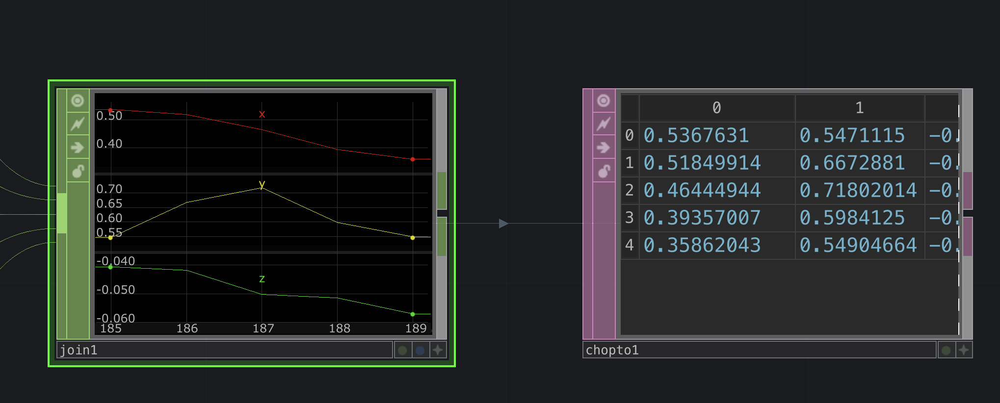

On crée ensuite un `CHOP to` DAT, et on fait glisser le `Join` CHOP pour créer un data link.

On a alors notre tableau avec les 5 lignes et 3 colonnes.

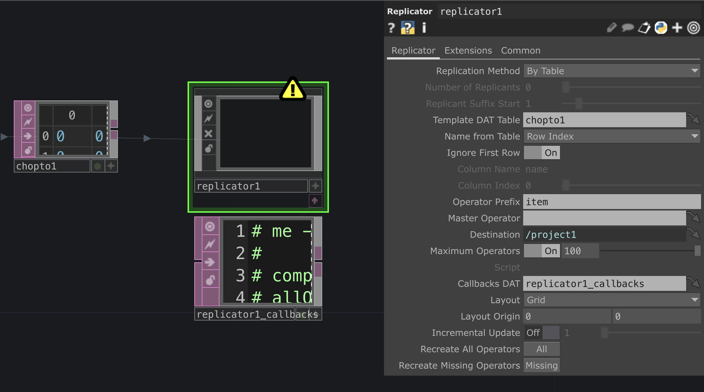

On crée un `Replicator` COMP et on fait glisser le `CHOP to` sur le paramètre "Template DAT Table".

On crée ensuite le "modèle" que le Replicator va recréer. En fonction de la complexité du modèle et des paramètres que l'on va modifier, on peut soit : 
- Créer directement une sphère et on combinera toutes les sphères dans `Merge` SOP
- Créer une `Base` COMP qui contiendra notre sphère et d'autres eléments et qu'on mettra tous dans un unique `Geo` à la fin (utile si on veux plusieurs géometrie différentes, comme une sphère + un cube sur chaque doigt)
- Créer une `Base` COMP qui contiendra notre sphère, un `Geo` et un `Render`, et on combinera tous les `Render` à la fin (utile si on veux appliquer un Material différent à chaque élement)

Je choisis ici la dernière méthode afin de montrer la manière la plus complète de le faire.

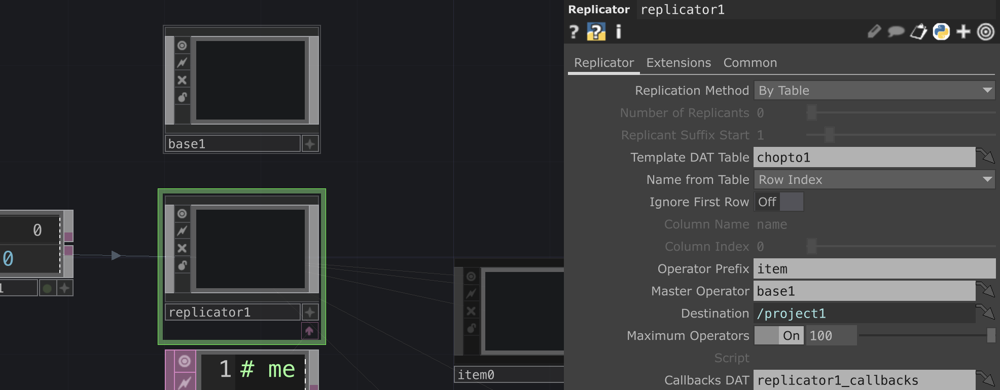

On commence donc par créer une `Base` COMP, dans laquelle on peut entrer en double-cliquant ou en appuyant sur "i" quand elle est selectionnée. Pour en sortir, on dezoom à max ou on appuie sur "u".

On fait glisser cette `Base` sur le paramètre "Master Operator" du `Replicator` et on décoche le paramètre "Ignore First Row".

On devrait alors voir 5 node nommées `item0` à `item4` car le Replicator a recréer le modèle en autant de fois qu'il y a de lignes dans le tableau DAT.

On entre alors dans la `Base` modèle, et on commence par créer un `Select` DAT pour venir récuperer le tableau DAT des coordonnées. On écrit "../chopto1" dans la paramètre "DAT" pour récupérer le node "chopto1" du parent de la `Base` (= l'extérieur de la `Base`).

On crée ensuite un `DAT to` CHOP, et on vient glisser le `Select` DAT sur le paramètre "DAT". On veux ne sélectionner que la ligne de l'item que l'on crée, et avoir 3 channels : x, y et z.
On commence par sélectionner "Channel per Column" dans le paramètre "Output" et sélectioner "Values" dans le paramètre "First Column is". On crée donc autant de channels que de colonnes et on précise que la première colonne ne contient pas des noms mais bien des valeurs.

Pour ne sélectionner que la ligne de l'item, on choisit "By Index" dans le paramètre "Select Rows". Dans "Start Row Index" et "End Row Index" on écrit "me.parent().digits".

"me.parent().digits" = le numéro de mon composant parent. Ici la `Base` s'appelle "Base1" donc me.parent().digits = 1. Donc pour "item0" ça sera 0, pour item4 ça sera 4, ainsi de suite.

Si on écrivait "me.digits" ça serait 1 pour chaque car la node s'appelle "datto1", mais ça serait 8 si la node s'appelait "datto8" et ainsi de suite.

On peut ajouter un `Rename` CHOP après le `DAT to` pour renommer nos 3 channels en x, y et z.

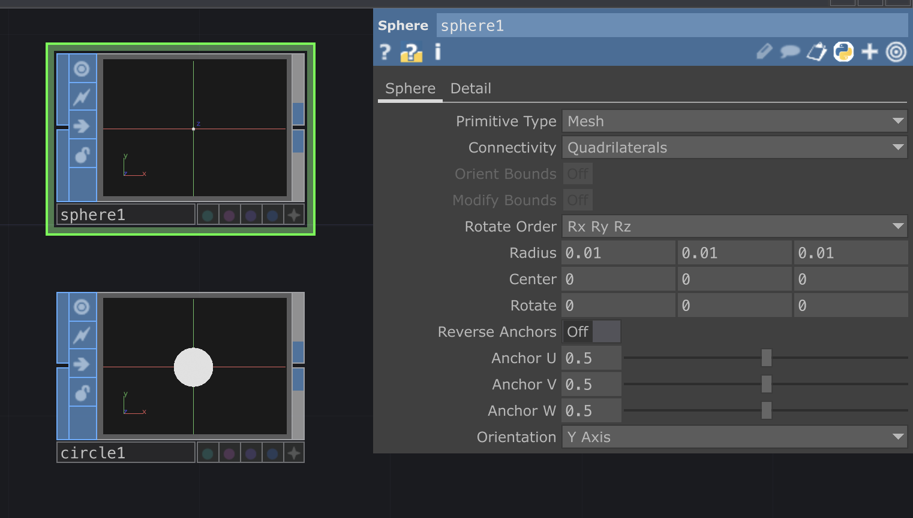

Maintenant qu'on a les positions, on peut créer un `Sphere` SOP, et un `Circle` SOP.

J'ai mis 0.02 en Radius x, y et z de la `Sphere` et 0.04 en Radius x et y du `Circle`.

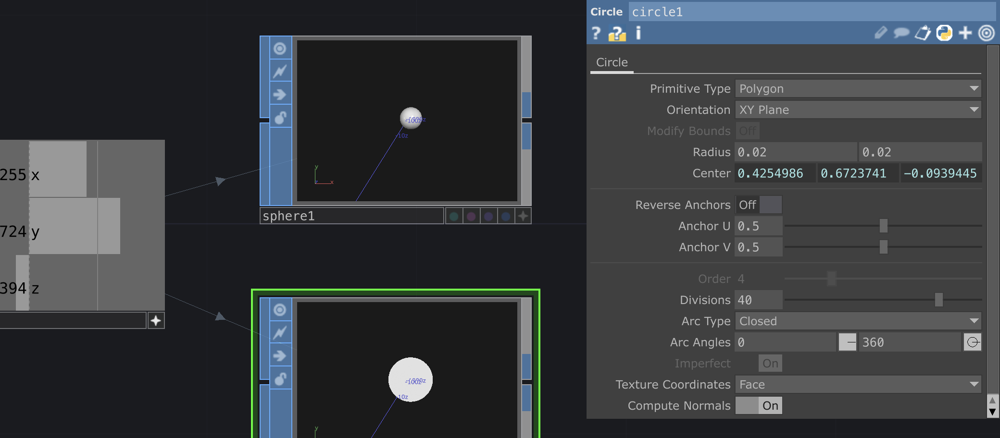

Dans les paramètres Center x, y et z de la `Sphere` et du `Circle`, on mets mes channels x, y et z en sortie du `Rename` CHOP. On peut alors les voir bouger si on bouge la main.

Comme je vais vouloir des Material différents pour la sphère et le cercle, on crée un `Geo` COMP pour chaque, mais un seul `Render` TOP et un seul `Camera` COMP.

Comme dans les deux méthodes précédentes, on modifie les paramètres du `Camera` en mettant 0.5 en Translate x et y, et 1 en Translate z dans le premier onglet des paramètres.
Dans l'onglet "View" des paramètre, on met "Orthographic" dans le paramètre "Projection" et "1" pour "Ortho Width".
On met également "0.9" en "Near" et "10" en "Far".

On crée ensuite un `Wireframe` MAT pour le Material du `Geo` de la sphère, et on sélectionne "Topology Wireframe" dans le paramètre "Wireframe Mode".

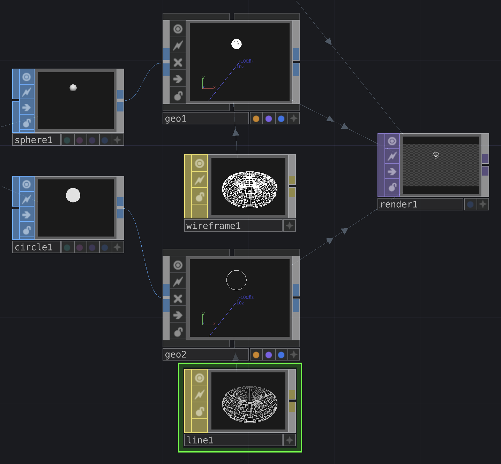

On crée également un `Line` MAT pour le Material du `Geo` du cercle.

Quand on regarde dans le `Render` TOP, on a alors notre sphère en wireframe entourée d'un cercle.

On peut alors sortir de la `Base`, et cliquer sur "All" dans le paramètre "Recreate All Operators" du `Replicator`.
Si on entre dans n'importe quel des `item`, on verra alors le même réseau mais avec une ligne du tableau de coordonnées différente.

À coté du `Replicator`, on crée un `Composite` TOP. Dans le paramètre "TOPs", on écrit "item*/render1" afin de sélectionner toutes les nodes "render1" dans les nodes dont le nom commence par "item". On choisit "Over" comme mode d'Operation, et on voit alors apparaître nos 5 élements.

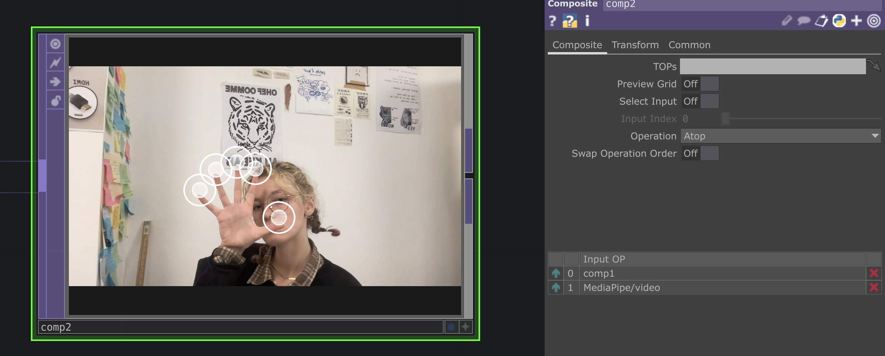

On crée un nouveau `Composite` TOP dans lequel on met également la dernière sortie du node `MediaPipe`, afin de mettre les sphères + cercles par dessus la webcam. On met "Atop" comme "Operation" dans les paramètres du `Composite`.

Notes: 
- On aurait pu également modifier la scale des élements en fonction de la distance de la main à la webcam avec la coordonnée z comme dans la méthode de l'instanciation
- On aurait pu créer des `Circle` TOP au lieu de faire de la 3D
- À chaque modification de la `Base` modèle, il faut recréer les "item" en cliquant sur "All" dans le paramètre "Recreate All Operators" du `Replicator` pour les "mettre à jour".

# Pour aller + loin

<!-- recalculer les données y en 3d : faire un select avec "*:y" ( * = tout, *:y = tout ce qui finit par y)-->
