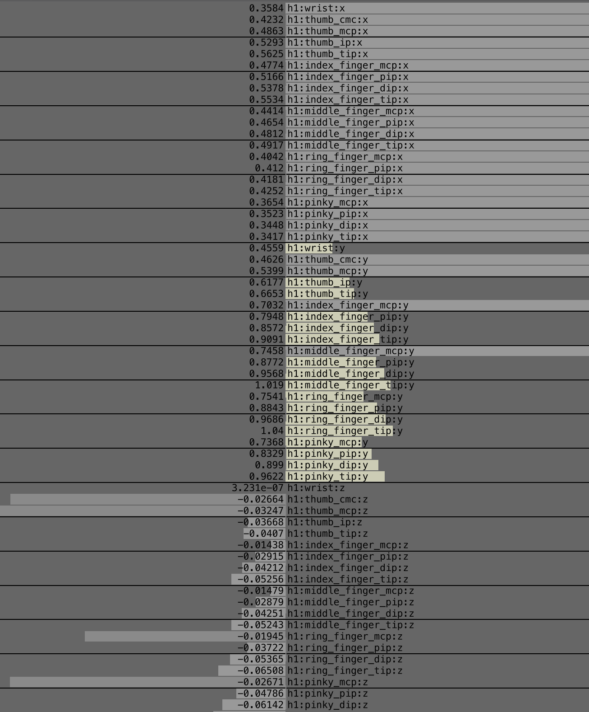
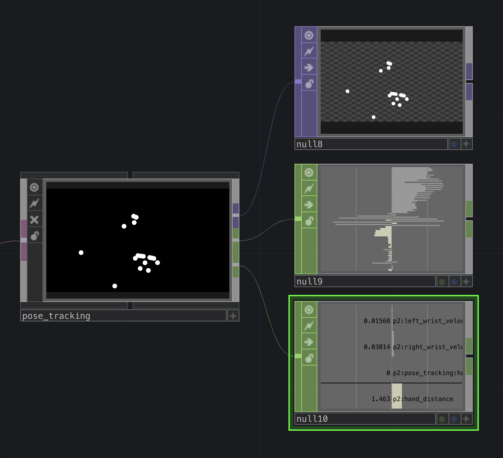
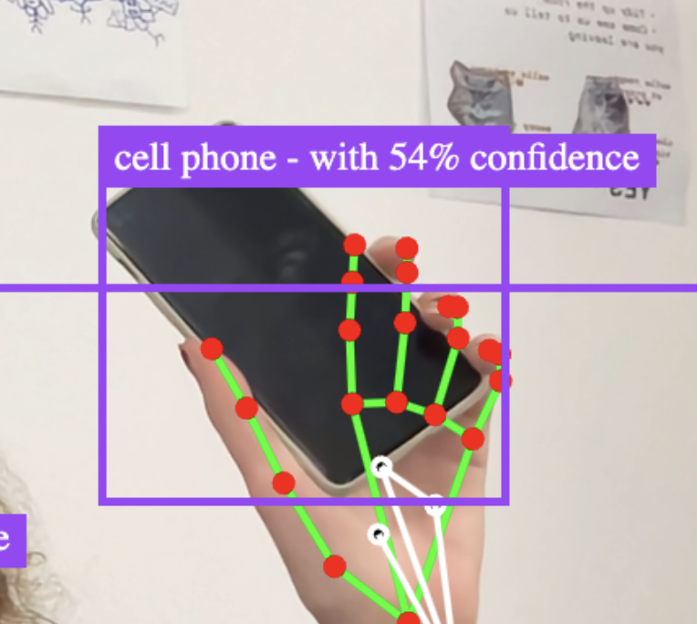
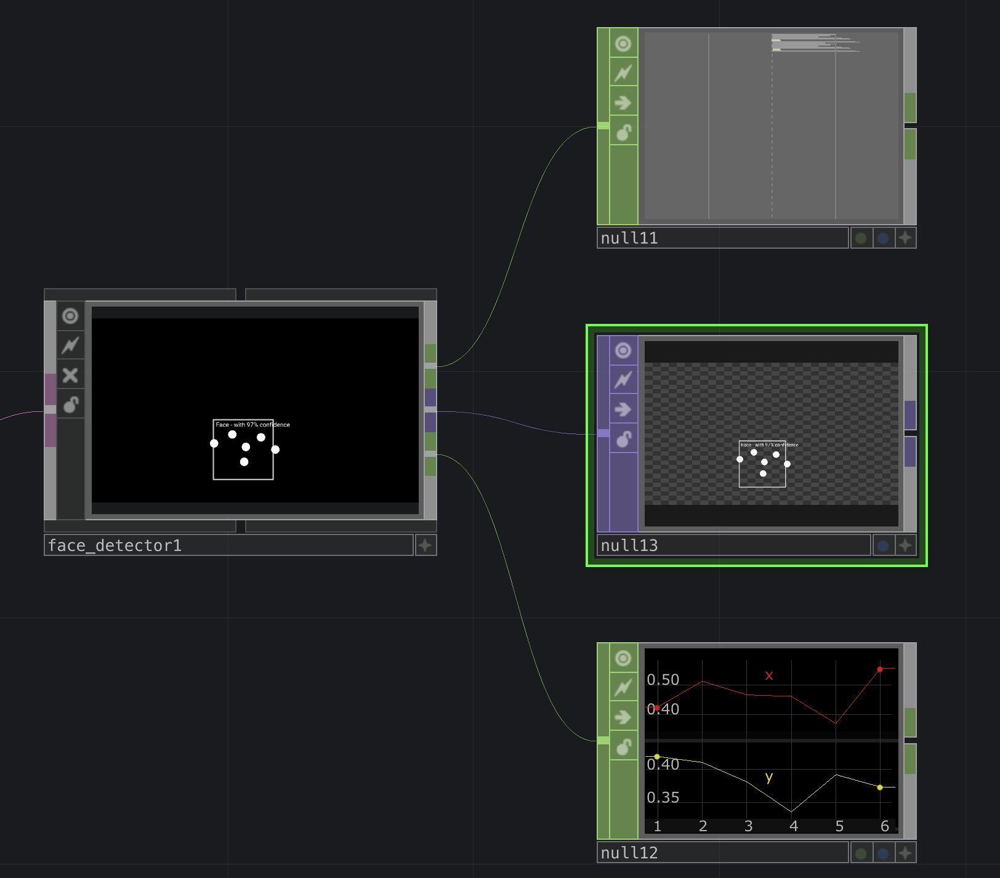
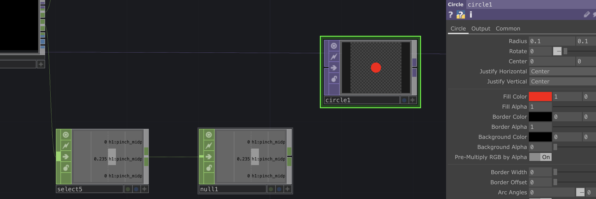
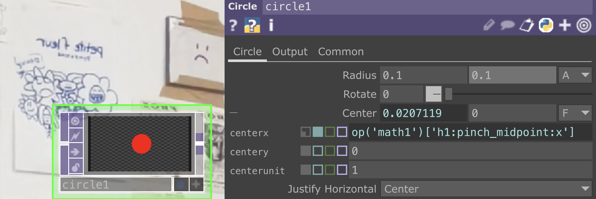
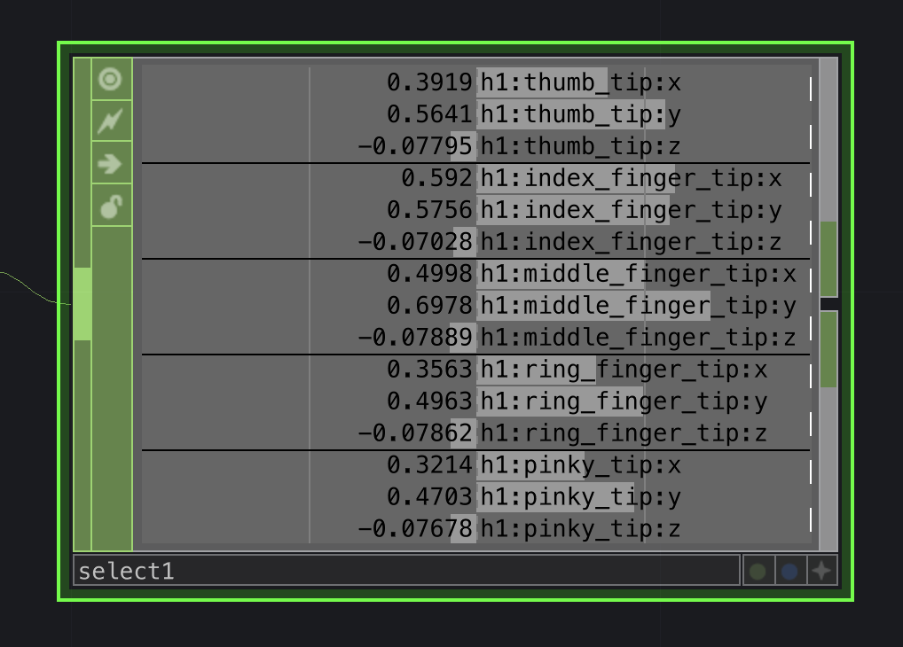
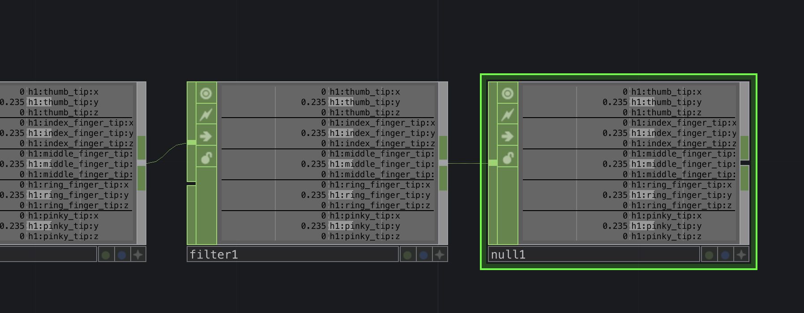
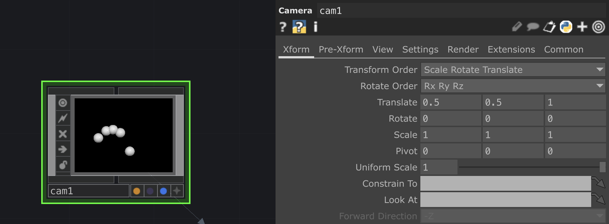

# MediaPipe sur Touchdesigner

*Ou comment utiliser MediaPipe dans TouchDesigner, récupérer les données et les utiliser pour interagir avec du visuel.*

- Le tuto [introduction à Touchdesigner](https://github.com/LucieMrc/IntroTD_FR)

## MediaPipe ???

[MediaPipe](https://developers.google.com/mediapipe) est un framework de machine-learning centré sur la computer vision.
Dans Touchdesigner, on peux l'utiliser notamment pour récuperer la position du squelette d'une personne devant une webcam, et créer des interactions avec.

La [documentation de MediaPipe pour TD](https://github.com/torinmb/mediapipe-touchdesigner?tab=readme-ov-file) sur github, avec la [vidéo de présentation](https://www.youtube.com/watch?v=Cx4Ellaj6kk&ab_channel=TorinBlankensmith).

Le [lien de téléchargement](https://github.com/torinmb/mediapipe-touchdesigner/releases) de la dernière version.

*Le fichier d'exemple MediaPipeTouchdesigner.toe.*

## Le fichier MediaPipeTouchdesigner.toe

### A. le node MediaPipe

Le node MediaPipe contient pleins de choses qui le font marcher, dans lesquels on ne rentrera pas en détails.

### B. les infos sur le temps réel

La première sortie du node MediaPipe est un CHOP qui permet de vérifier si on récupère bien les données en temps réel.

### C. le tracking du visage, des mains et du squelette

Le tracking du visage avec le node face_tracking permet de récupérer notamment la position du visage et de chacun de ses points, ainsi qu'un masque 3D du visage. On peux tracker jusqu'à 5 visages.

Le tracking des mains avec le node hand_tracking permet de récupérer la position des mains et de leurs points, ainsi qu'un rendu 3D.

*Les points de la main gauche et des doigts*

On récupère également la vélocité des mains, la distance entre les mains, et les données du geste de "pincer" dans le CHOP `helpers`, et 8 gestes pour chaque main dans le CHOP `gestures`.

Le tracking du squelette avec le node pose_tracking permet de récupérer les positions des différentes parties du corps, ainsi que la vélocité des poignets et la distance des mains. On peux tracker jusqu'à 5 personnes.

### D. la détection des objets et du visage

La détection et la classification des objets avec le node object_tracking1 sert à reconnaître les objets sur la vidéo avec plus ou moins de certitude. Ça ne marche pas hyper bien.

*Ici la détection de mon téléphone avec seulement 55% de certitude*

Le node face_detector1 sert à détecter des visages et sortir la positions de leurs points.

Le node image_classification essaie de reconnaître des objets sur l'image. Ça ne marche pas hyper bien.

### E. la Virtual Webcam Chain

Je ne suis pas vraiment sûre de l'usage de la Virtual Webcam Chain.

### F. le node image_segmentation

En cochant le paramètre `Image Segmentation` dans le node MediaPipe, le visuel de la webcam dans le node MediaPipe devient segmenté par couleur en fonction de la partie du corps (main, visage, cheveux) et du fond.

En sortie du node image_segmentation, on a alors une sortie par couleur qui nous donne la forme en blanc sur fond transparent, et la silhouette en couleur sur fond transparent si la Virtual Webcam Chain est activée.

Le mieux est de décocher `Show overlays` pour enlever toutes les détections sur l'image de la webcam et ne pas les avoir sur les images segmentées.

## Récupérer les données

On peux récupérer les données des points detectés par MediaPipe (position du visage, des mains, du corps, ainsi de suite) pour venir faire apparaître et déplacer des élements par dessus le retour webcam.
Pour cela, on peux le faire en 2D avec des TOP ou en 3D avec des SOP.

## En 2D avec des TOPs

Pour n'activer que le hand tracking vu qu'on n'utilise que les points de la main, on décoche tout sauf "Detect Hands" dans les paramètres de `MediaPipe`. On n'oublie pas de décocher également "Show overlays" pour que les points detectés ne s'affichent pas par dessus l'image de la webcam.

 
On peux par exemple récupérer la position du "pinch" (le pincée entre le pouce et l'index), et l'écart mesuré. On crée un `Select` TOP sur la sortie "helpers" (la 4ème), et on sélectionne "h1:pinch_midpoint:distance" (l'écart entre les doigts), "h1:pinch_midpoint:x" et "h1:pinch_midpoint:y" (la position x et y du milieu de l'écart entre les doigts).

On crée ensuite un `Circle` TOP, et on change le paramètre "radius" de 1 à 0.1. Finalement, on change la résolution afin qu'elle soit la même que la webcam (ici, 1280*720).

Pour que le cercle se déplace, on assigne la variable "h1:pinch_midpoint:x" à "center x", et "h1:pinch_midpoint:y" à "center y".

On voit néanmoins que le cercle reste dans le coin en haut à droite de l'image au lieu de se déplacer dans toute l'image.

En effet, les positions x et y du midpoint sont normalisées entre 0 et 1 où 0,0 est en bas à gauche de l'image, tandis que sur les textures dans TouchDesigner, le 0,0 est au milieu de l'image et les positions x et y sont entre -0.5 et 0.5 .

Il faut donc décaler cette plage de valeur, et pour cela on crée un `Select` CHOP pour choisir uniquement "h1:pinch_midpoint:x", puis on crée un `Math` CHOP.

Dans l'onglet "Range" du `Math` CHOP, on garde de 0 à 1 pour "From Range" et on met de -0.5 à 0.5 pour la "To Range".

En assignant la variable "h1:pinch_midpoint:x" du `Math` CHOP à "center x" du `Circle` TOP, notre cercle se déplace maintenant bien dans toute l'image sur x.

Pour faire la même chose pour y, on recrée un `Select` CHOP en sortie du `Select` précedent,  pour choisir "h1:pinch_midpoint:y", puis on crée un `Math` CHOP.

Dans l'onglet "Range" du `Math` CHOP, on doit mettre de 0.2 à 0.8 pour "From Range", car c'est les minimum et maximum que l'on observe en déplaçant la main de bas en haut de l'écran, et on met de -0.5 à 0.5 pour la "To Range".

En assignant la variable "h1:pinch_midpoint:y" du `Math` CHOP à "center y" du `Circle` TOP, notre cercle se déplace maintenant bien dans toute l'image sur x et sur y.

On peux alors créer un `Composite` TOP et y entrer le `Circle` TOP ainsi que l'image de la webcam en sortie du node MediaPipe, et utiliser l'opération "Over" dans les paramètres du `Composite`. On voit donc le cercle bouger en suivant le milieu entre le pouce et l'index.

Pour que la taille du cercle dépende de l'écart entre les doigts, on assigne la variable "h1:pinch_midpoint:distance" au paramètre "Radius" du `Circle` TOP. Ici, je divise par deux la variable afin que cercle soit plus petit.

## En 3D avec des SOPs

Il y a plusieurs manières permettant de déplacer des élements en 3D grâce aux données de MediaPipe. On choisit la manière la plus adaptée en fonction du nombre d'élements, des interactions entre les différents élements interagissent et en fonction des paramètres spécifiques à ces élements.

### Data link

On utilise les data link, la manière dont on a fait apparaître un point rouge 2D ci-dessus, lorsque qu'on veux faire apparaître peu d'élements, et/ou que l'on veux pouvoir jouer avec les paramètres propres de chaque élement. C'est néanmoins la méthode la plus longue.

C'est la méthode utilisée dans le projet "handTrackingExemple.toe".

Il faut d'abord sélectionner les coordonnées des points qui nous intéressent. Ici, on va venir placer une sphère sur la pointe de chaque doigt (= fingertip).

On crée donc un `Select` CHOP à la deuxième sortie du node `MediaPipe`, et on sélectionne dans "Channel Names" les valeurs x, y et z de chaque bout de doigt pour h1.

Donc pour le pouce : h1:thumb_tip:x h1:thumb_tip:y h1:thumb_tip:z

Pour l'index : h1:index_finger_tip:x etc

Puis pareil pour h1:middle_finger_tip, h1:ring_finger_tip, h1:pinky_tip en x y et z pour chaque.

Si on veux avoir les deux mains, on peux faire pareil pour h2.

Après le `Select`, on crée un `Filter` CHOP afin de lisser légèrement les données et éviter les mouvements saccadés. On met 0.2 dans le paramètre "Filter Width" ce qui veux dire que les valeurs sont lissées sur 0.2 secondes.

Plus la valeur (en seconde) est élevée, plus il y aura un effet de "lag" sur le déplacement, ne pas hésitez à revenir modifier la valeur du `Filter` plus tard pour choisir la valeur idéale.

On ajoute un `Null` CHOP après le `Filter`.

Ensuite, on crée 5 `Sphere` SOP, qui se placeront au bout des 5 doigts. Dans les paramètres de chaque SOP, on met 0.05 comme Radius x, y et z.

Dans les paramètres du premier `Sphere` SOP, on met les coordonnées x, y et z du pouce en sortie du `Null` CHOP dans le paramètre Center x, y et z.

On fait pareil pour les coordonnées de chaque doigt sur chaque sphère.

On crée ensuite un `Merge` SOP pour réunir les 5 sphères.

On crée finalement un `Geo` COMP, puis un `Render` TOP pour obtenir un rendu de nos sphères.

Pour la camera, on crée un `Camera` COMP mais dans les paramètres on met 0.5 en Translate x et y, et 1 en Translate z dans le premier onglet.

Dans l'onglet "View" des paramètres de la `Camera`, on met "Orthographic" dans le paramètre "Projection" et "1" pour "Ortho Width".

On met également "0.9" en "Near" et "10" en "Far".

Sans ces modifications, on ne pourra placer le rendu par dessus l'image de la webcam.

On crée un `Constant` MAT pour appliquer une couleur sur le `Geo`.

Après le `Render` TOP, on crée un `Composite` TOP dans lequel on met également la dernière sortie du node `MediaPipe` afin de mettre les sphères par dessus la webcam. On met "Atop" comme "Operation" dans les paramètres du `Composite`.

### Instaciation

On utilise l'instanciation lorsque l'on veux créer rapidement beaucoup d'élements, sur lesquels on ne pourra pas agir individuellement.

### Replicator

On utilise le Replicator lorsque l'on veux créer beaucoup d'élements, sur lesquels on ne pourra pas beaucoup agir individuellement mais on pourra agir sur autant de paramètres que l'on souhaite. Cette méthode est également applicable aux TOPs.

# Pour aller + loin

<!-- recalculer les données y en 3d : faire un select avec "*:y" ( * = tout, *:y = tout ce qui finit par y)-->
